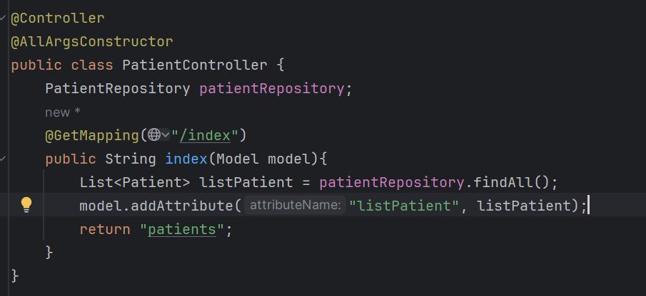

<h3>Partie 1 :</h3>

<h4>I. Creation de l'entité Patient avec creation du repository, creation du Controller et affichage de la liste des patients : </h4>
<h5>1. Entité Patient :</h5>

<h5>2. Patient Repository :</h5>

<h5>3. PatientController :</h5>

<h5>4. Vue patients.html avec thymleaf:</h5>

<h5>5. Affichage de la liste des patients :</h5>

<h4>II. Pagination :</h4>
<h5>1. la liste des patients avant pagination :</h5>

<h5>2. appliquer la pagination :</h5>

<h5>3. la liste des patients apres pagination :</h5>

<h4>III. Chercher un patient :</h4>
<h5>1. Ajout du parametre keyword et ajouter l'attribut keyword au model:</h5>

<h5>2. Ajout du formulaire de recherche:</h5>

<h5>3. Ajout de la methode findByNameContains pour effectuer la recherche dans PatientRepository :</h5>

<h5>4. Affichage du resultat d'une recherche:</h5>

<h4>III. Supprimer un patient :</h4>
<h5>1. Ajout du boutton de suppression avec une confirmation de suppression:</h5>

<h5>2. Ajout de la methode delete pour supprimer le patient de la table à partir de son ID :</h5>

<h5>3. Suppression du patient numero 8 :</h5>

<h5>5. Voir le resultat :</h5>

<h4>IV. Amelioration supplementaire :</h4>
<h5>1. Transmettre Keyword et current page vers delete :</h4>

<h5>2. Transmettre keyword et current page lors de la redirection Key :</h4>

<h5>3. Mettre des icons à la place de Chercher et Delete :</h4>

<h5>4. ajouter la methode home dans PatientController qui redirige vers index :</h4>

